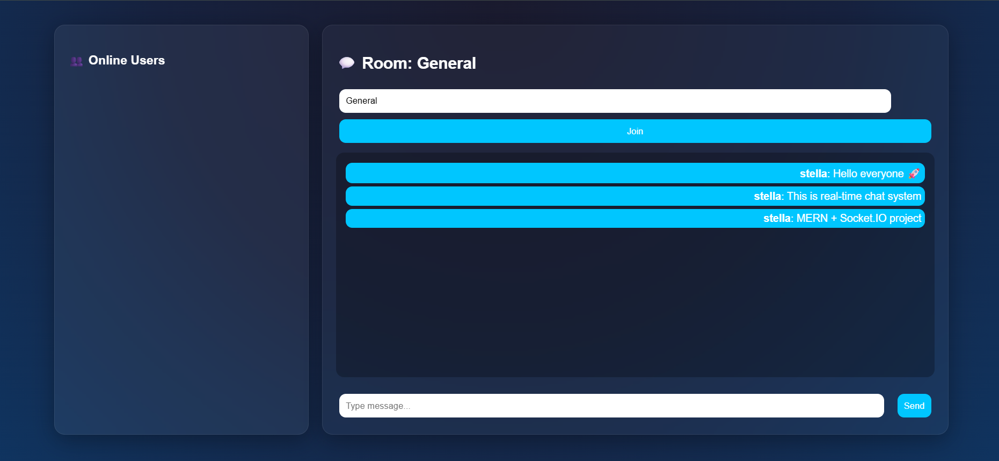
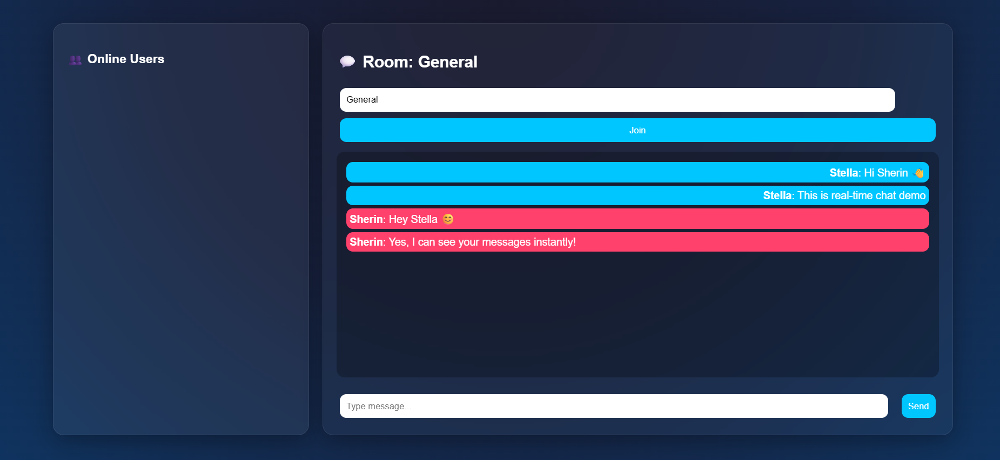

# Community Discussion Forum with Real-Time Chat

A Full Stack MERN + Socket.IO real-time community platform where users can register, login, create discussions, like posts, comment, and chat in real-time.

This project works like a **Discord + Reddit hybrid system**.

---

## Features

### Authentication
- User Registration
- Login System
- Password Hashing using bcrypt
- JWT Authentication

### Real-Time Chat
- Live messaging using Socket.IO
- Room-based chat system
- Typing indicator
- Online users list

### Discussion System
- Create posts
- View all discussions
- Like posts
- Comment on posts
- Real-time updates

### UI Features
- Dark modern interface
- Glassmorphism design
- Responsive layout
- Clean chat interface

---

## Tech Stack

### Frontend
- React (JavaScript)
- Axios
- Socket.IO Client

### Backend
- Node.js
- Express.js
- MongoDB + Mongoose
- Socket.IO
- JWT
- bcrypt

---

## Project Structure
Community-Forum-Chat/
│
├── client/
│ ├── src/
│ │ ├── App.js
│ │ ├── socket.js
│
├── server/
│ ├── server.js
│ ├── .env
│
└── README.md


---

## Installation

### Step 1: Clone the repository
```bash
git clone https://github.com/your-username/community-forum-chat.git
cd community-forum-chat
```
### Step 2: Backend setup

```
cd server
npm install

```
Create .env file:

```
PORT=5000
MONGO_URI=mongodb://127.0.0.1:27017/community_forum
JWT_SECRET=secret123

```
Run backend:

```
node server.js

```
### Step 3: Frontend setup

```
cd client
npm install
npm start

```
### How to Run
Frontend: http://localhost:3000
Backend: http://localhost:5000


---
## Screenshots

### Chat UI


### 2 User Interaction


---
## Learning Outcomes
- MERN stack development
- Real-time communication using Socket.IO
- Authentication using JWT
- Database design using MongoDB
- Full stack architecture
- UI/UX design

---
## Future Improvements
- Notifications system
- Profile pages
- Image sharing in chat
- Message timestamps
- Deployment on Vercel + Render

---
## Author

Nidhi Apotikar
